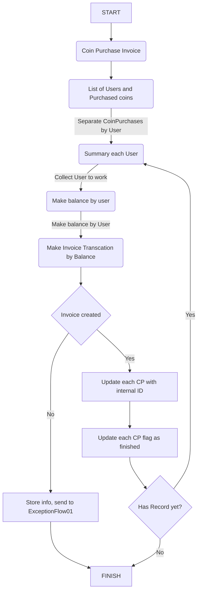

## Reference:
### [MermaidLive Preview](https://mermaid.live)

```mermaid

flowchart
    Start[START] --> CoinPurchaseList 
    CoinPurchaseList(Coin Purchase Invoice)
        --> ListUser(List of Users and Purchased coins)
    
    
    ListUser -->|Separate CoinPurchases by User| SummaryUser(Summary each User)
    SummaryUser 
        --> |Collect User to work| BuildBalance(Make balance by user)
    BuildBalance --> |Make balance by User| BuildInvoice(Make Invoice Transcation by Balance) 
        --> IsCreatedInvoice{Invoice created}


    IsCreatedInvoice 
        --> |Yes| UpdateCP[Update each CP with internal ID]
        --> UpdateCPFlag[Update each CP flag as finished]
        --> RemainRecord{Has Record yet?}

    IsCreatedInvoice
        --> |No| ExceptionFlow01[Update user]
        
    ExceptionFlow01[Store info, send to ExceptionFlow01]
        --> Finish


    RemainRecord 
        --> |Yes| SummaryUser

    RemainRecord
        --> |No| Finish


    Finish[FINISH]

```